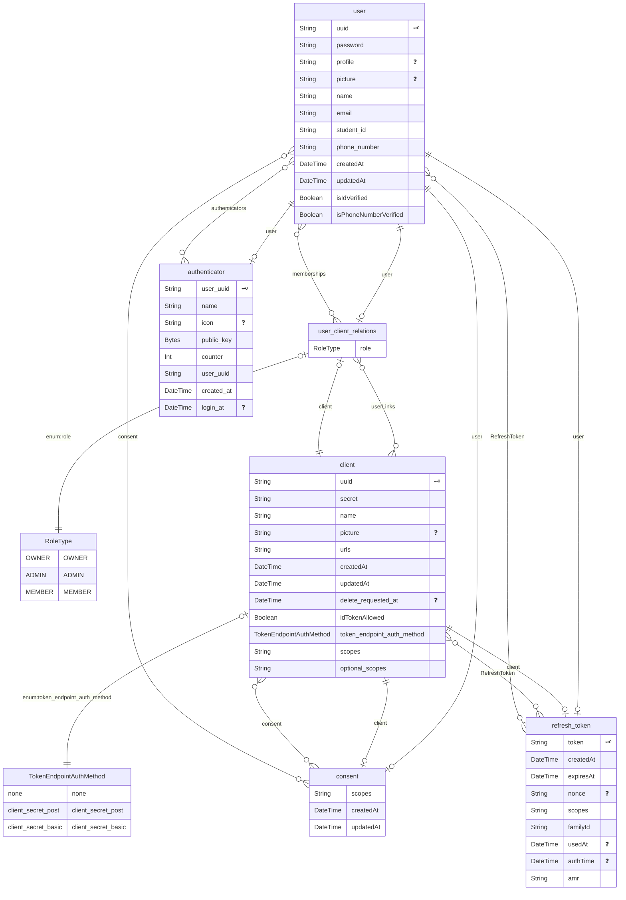

```mermaid
erDiagram

        TokenEndpointAuthMethod {
            none none
client_secret_post client_secret_post
client_secret_basic client_secret_basic
        }
    


        RoleType {
            OWNER OWNER
ADMIN ADMIN
MEMBER MEMBER
        }
    
  "user" {
    String uuid "🗝️"
    String password 
    String profile "❓"
    String picture "❓"
    String name 
    String email 
    String student_id 
    String phone_number 
    DateTime createdAt 
    DateTime updatedAt 
    Boolean isIdVerified 
    Boolean isPhoneNumberVerified 
    }
  

  "client" {
    String uuid "🗝️"
    String secret 
    String name 
    String picture "❓"
    String urls 
    DateTime createdAt 
    DateTime updatedAt 
    DateTime delete_requested_at "❓"
    Boolean idTokenAllowed 
    TokenEndpointAuthMethod token_endpoint_auth_method 
    String scopes 
    String optional_scopes 
    }
  

  "user_client_relations" {
    RoleType role 
    }
  

  "refresh_token" {
    String token "🗝️"
    DateTime createdAt 
    DateTime expiresAt 
    String nonce "❓"
    String scopes 
    String familyId 
    DateTime usedAt "❓"
    DateTime authTime "❓"
    String amr 
    }
  

  "consent" {
    String scopes 
    DateTime createdAt 
    DateTime updatedAt 
    }
  

  "authenticator" {
    String user_uuid "🗝️"
    String name 
    String icon "❓"
    Bytes public_key 
    Int counter 
    String user_uuid 
    DateTime created_at 
    DateTime login_at "❓"
    }
  
    "user" o{--}o "user_client_relations" : "memberships"
    "user" o{--}o "consent" : "consent"
    "user" o{--}o "refresh_token" : "RefreshToken"
    "user" o{--}o "authenticator" : "authenticators"
    "client" o|--|| "TokenEndpointAuthMethod" : "enum:token_endpoint_auth_method"
    "client" o{--}o "user_client_relations" : "userLinks"
    "client" o{--}o "consent" : "consent"
    "client" o{--}o "refresh_token" : "RefreshToken"
    "user_client_relations" o|--|| "user" : "user"
    "user_client_relations" o|--|| "client" : "client"
    "user_client_relations" o|--|| "RoleType" : "enum:role"
    "refresh_token" o|--|| "client" : "client"
    "refresh_token" o|--|| "user" : "user"
    "consent" o|--|| "client" : "client"
    "consent" o|--|| "user" : "user"
    "authenticator" o|--|| "user" : "user"
```
